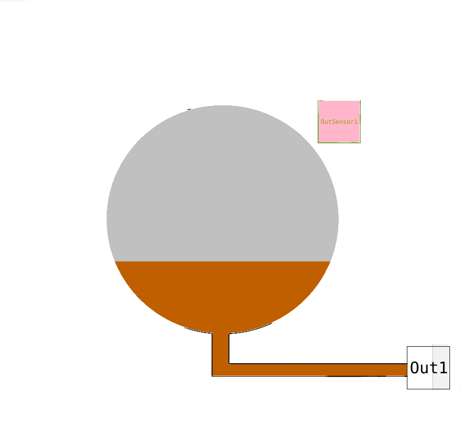
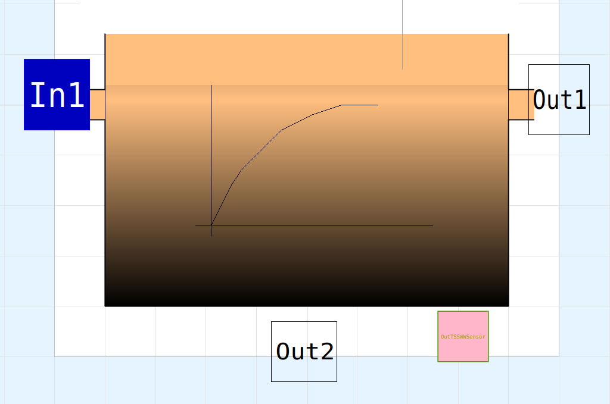
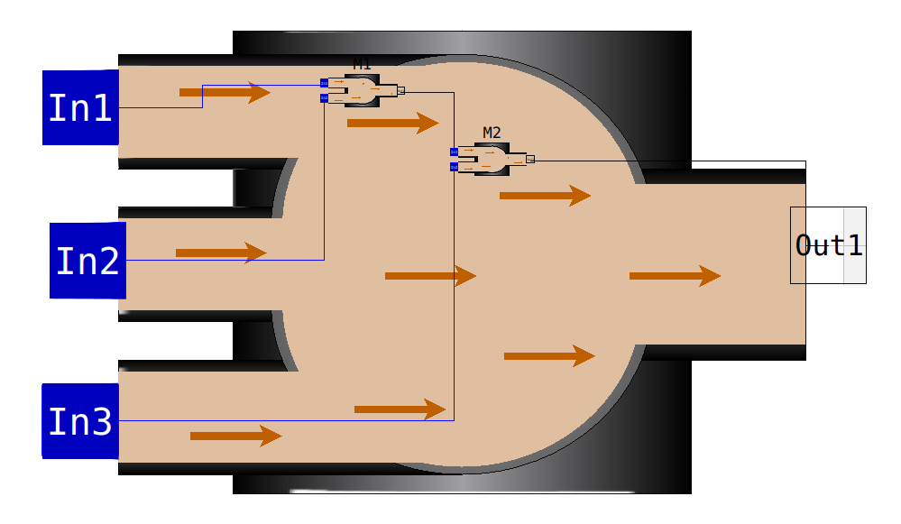
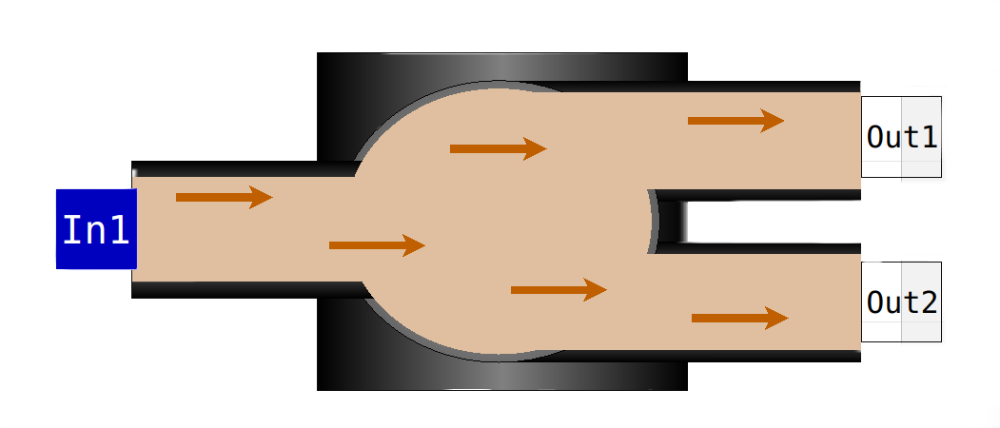
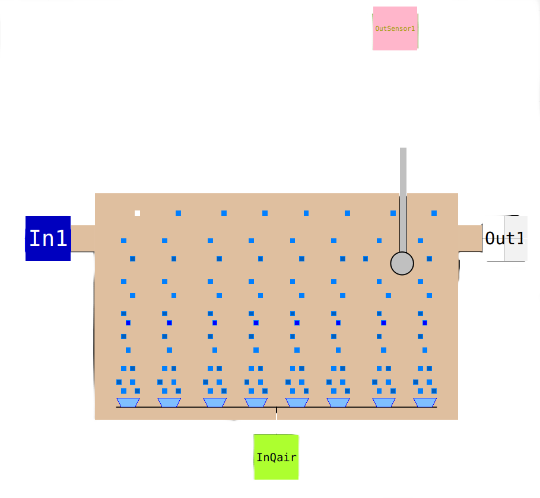
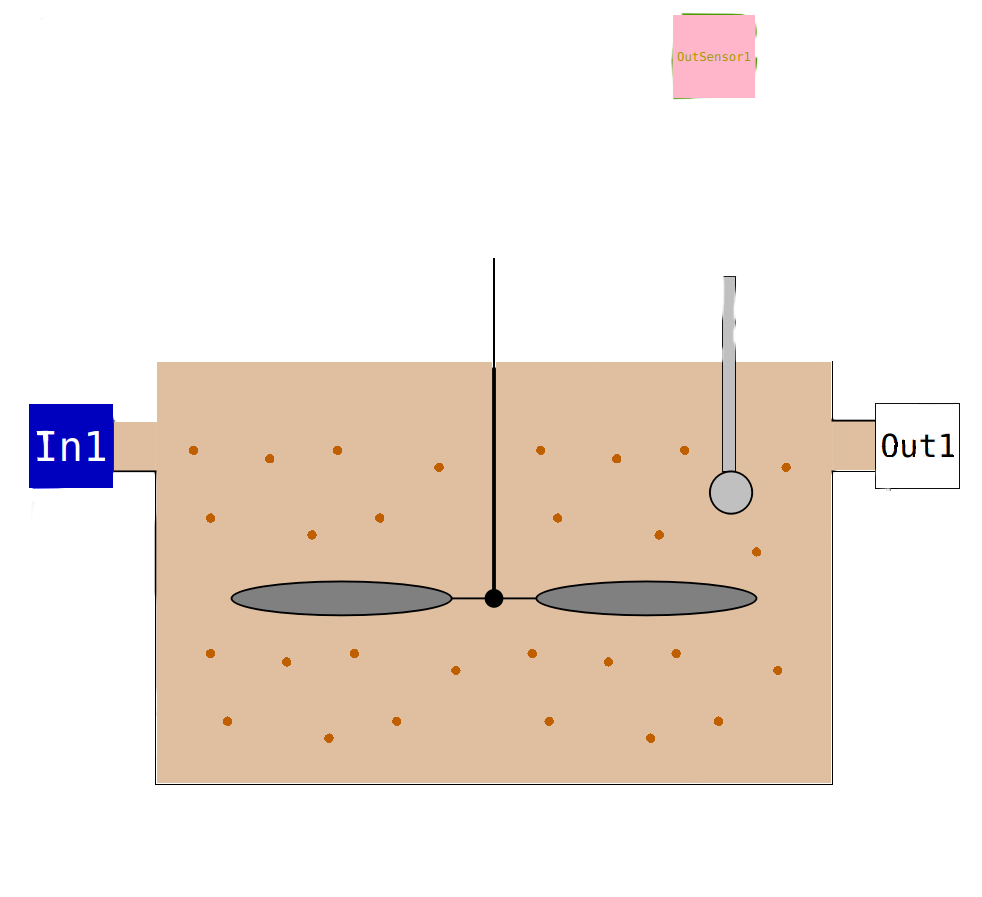
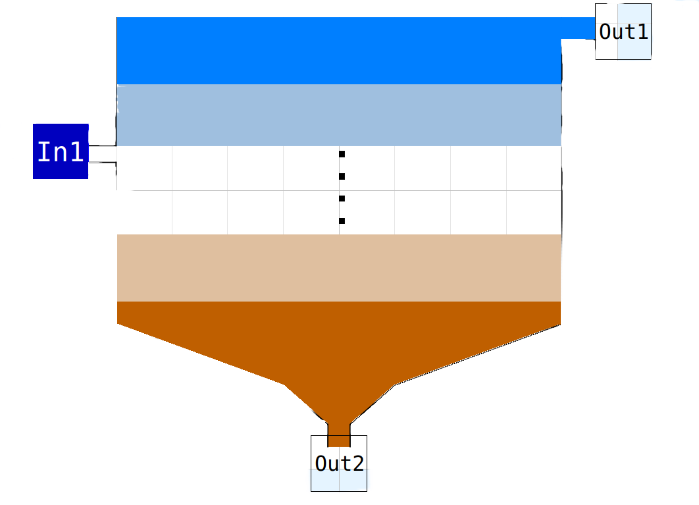
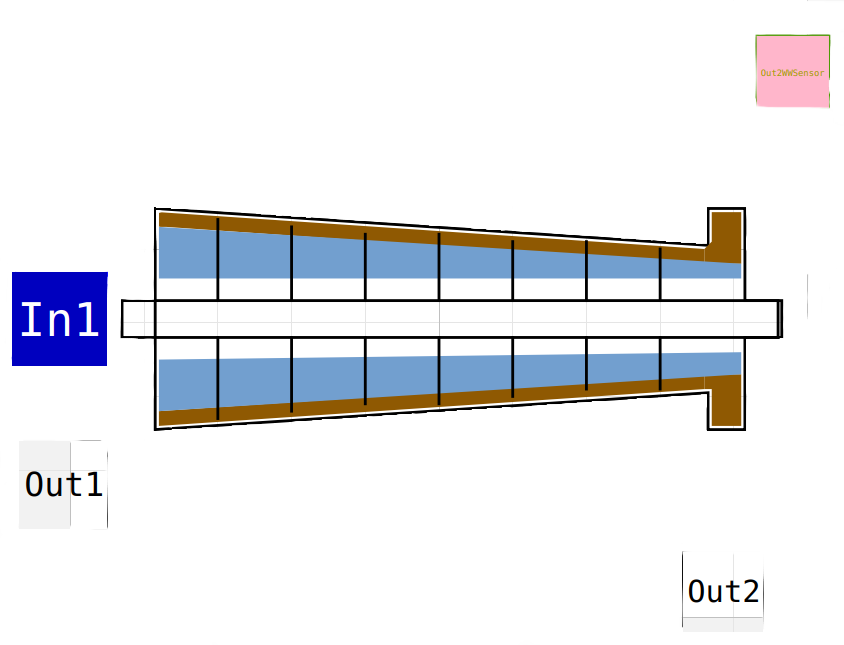
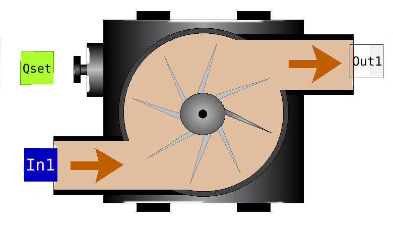
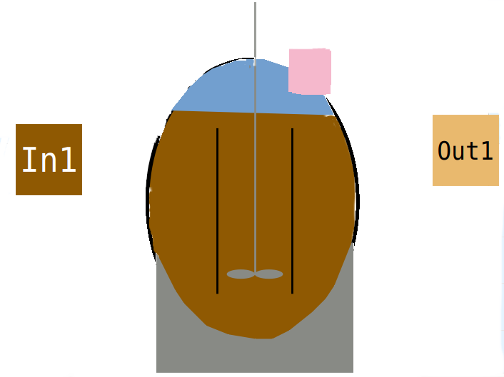

# OpenWasteWater (OpenModelica library)

### with Openmodelica (www.openmodelica.org)

Main Author:  
   Joachim Behrendt  
   Hamburg University of Technology  
   Institute of Wastewater Management and Water Protection  
   Eissendorfer Str. 42  
   21073 Hamburg, Germany  
   email: j.behrendt@tuhh.de  


## Motivation

This package is developed manly for teaching purposed at TUHH. The students should learn process modelling features and the complexity of the wastewater treatment system. The modelica language was a very fruitful approach, because the students can develop a complex model and don't have to worry about the numerical methodes to solve theire equation. To give the student a sustainable tool, open source software was required. Thank's to Lund University to publish the OpenModelica platform (www.openmodelica.org) that included the modeical library. The basic constructs are working perfectly but many libraries (as well as third party libraries) are leeding to frustration, because they have a limited documentation and have buggs in OpenModelica. 

The Wastewater package, originally developed by Gerald Reichl were adopted to Dymola, (C) Dassault Systèmes(R), where the free version is not able to solve these amount on equations. In Modelica a concept of "connector" exist that is relaxed in Dymola. Another argument is to develop a wastewater library for wastewater professional/student to make use in practise and education. The original approach was more adopted to controll engineering and matlab/simulik. 

Gerald Reichl took a lot of work to make nice icons, that are recycled in this approach. He made modells for ASM 1,2d, and 3 and different clarifier models. Here we are focusing on the ASM1 only and a simplifierd clarifier model and the model of Takács only. The clarifier model have a minor effect to the result and one model gives a good base for further development. In addition, a suldge treatment in involved, with thickener und centrifuge as well as anaerobig digster. The Anaerobic digster model ADM is mainly developed for sludge digestion. The implementation was mainly done by Moritz Liedke in the frame of his master thesis at TUHH.

In the frame of this documentation the wastewatermodels are not explained. Please refer following references:

**Henze M., Grady Jr C.P.L., Gujer W., Marais G.v.R. and Matsuo T.** (1986): Activated sludge model No.1, IAWQ Scientific and Technical Report No.1, IAWQ, London.  
IWA Task Group for Mathematical Modelling. Activated Sludge Models. IWA Publishing,
2000.  
**D.J. Batstone et al. (2002)**: The IWA Anaerobic Digestion Model No.1 (ADM1). Water Science and Technology  
IWA Task Group for Mathematical Modelling of Anaerobic Digestion Processes. Anaerobic Digestion Model No.1 (ADM1). IWA Publishing, 2002  
<https://www.cs.mcgill.ca/~hv/articles/WWTP/sim_manual.pdf> read at May 3 2019  
<https://publications.europa.eu/en/publication-detail/-/publication/8448ef88-37dd-4d1a-823f-3143e7902429> read at Mai 3 2019  

## Basic concept of the Wastewater Model

This library offers tools to make an advanced model for a wastewater treatment plant including sludge treatment. As modelling base the ASM1 and the ADM1 were chosen and can be adapted to the individual needs. The library can be used in teaching, research and as well in optimisation of existing WWTP. The model starts always with a source, where the concentrations, the flow rate and the temperature are defined. The flow is directed to the wastewater sink(s). All internal flows like recirculation, or dividing has to be realised with pumps to fulfil the requirements of a **flow variables** in modelica. 

For every flow variable in modelca, a **potential variable** is required. For a flow this should be the pressure, but we don't make hydrodynamic modelling. Therefore, the temperature is chosen to be the potential variable an in declared in the inflow. The stream variables are not declared as stream variables, because the our wastewater components are grouped in form of **records**. For stream variables don't work with records. It is not possible to add variables we have to use the prefix **input** or **output**. This explications may confuses, but you are getting it while reading the part where the **connectors** are explained. 

The modelling can be done graphically. You can create a new model and place the sub-model via mouse to the new model. The model without icons are not intended for the direct use. Now you can connect the model with the mouse clicking on a output connector, moving the mouse to an input connector and clicking here again. Then a line should be sketched. You can click on the way as well to achieve a better looking line. If the model is complete, please save it. If no error occurs, you can run the model and have fun.


## Description of the model

### Data types
Beside of common data types like (Real, Integer, Boolean...) data are  combined in a special class **record**. Record of **Soluble** and **Particulate** are defined, where the components are representing the dissolved or particulate components.

```
record Soluble
  Real O2 "gO2/m3 dissolved oxygen";
  Real I "gCOD/m3 inert soluble organic material";
  Real S "gCOD/m3 readily biodegradable organic substances";
  Real NH "gN/m3 ammonium + ammonia N";
  Real NO "gN/m3 nitrite + nitrate N";
  Real ND "gN/m3 dissolved organic N";
  Real ALK "mol/m3 alkalinity";
end Soluble;

record Particulate
  Real H "gCOD/m3 heterotrophic bacteria";
  Real A "gCOD/m3 autotrophic bacteria";
  Real S "gCOD/m3 particulate slowly degradable substrates";
  Real I "gCOD/m3 inert particulate organic material";
  Real P "gCOD/m3 inert particulate organic matter resulting from decay";
  Real ND "gN/m3 particulate organic nitrogen";
end Particulate;
```

The use of this records makes the formulation of **connector**s easier. The data type **record** can used  as component references in expressions 
```
Sini =  Soluble(I = 30, S = 1.15, O2 = 4.0, NH = 0.2, NO = 10.9, ND = 0.9, ALK = 3.54);
```
Sini can be used as initial condition in the **initial equation** block.


### Functions
Only few functions are formulated. These functions has to adapt to your specified needs.

#### 1. Calculation of the saturation concentration of oxygen
```
function fS_O2sat
  input Real T;
  output Real S_O2sat;
algorithm
  S_O2sat := exp(7.7117 - 1.31403 * log(T + 45.93));
  annotation(
    defaultComponentName = "fS_O2sat",
    Documentation(info = "<html>
    <H1 style=\"font-size:20px\">Saturation concnetration of oygen </H1>
    <p style=\"font-size:20px\">
    This function determines the saturation concentration of
    oxygen in water aerated with air as function
    of the temperature<br />
    (T in °C S_O2sat in g/m3)
    </p>
  </html>"));
end fS_O2sat;
```
A correlation of the saturation concentration with the temperature is used. Additionally a ß-value can be introduces. The ß-value is the relation between the saturation concentration in the wastewater and the saturation concentration in pure water. For municipal wastewater ß is in the range of 0.95 - 1.

#### 2. Calculating the volumetric mass transfer coefficient for oxygen

```
function fkLa
  output Real kLa "specific mass transfer coefficient, 1/d";
  input Real Q "air flow rate, m³/d";
  input Real V_R = 1333 "reactor volume, m³";
  input Real H = 4.5 "fluid height, m";
protected
  Real kLa_stern "-";
  Real v = 10 ^ (-6) "kinematic viscosity of water, m²/s";
  Real g = 9.81 "gravity, m/s²";
  Real w "m/d";
  Real w_stern "-";
algorithm
  w := Q * H / V_R;
  w_stern := w / (84600 * (g * v) ^ (1 / 3));
  kLa_stern := 1.17 * 10 ^ (-4) * w_stern ^ (-0.1);
  kLa := kLa_stern * w / (v ^ 2 / g) ^ (1 / 3);
  annotation(
    defaultComponentName = "klacalc",
    Documentation(info = "<html>
<H1 style=\"font-size:20px\">kLa calculation</H1>
<p style=\"font-size:20px\">
This function calculates the specific mass transfer coefficient kLa in '1/d' for a defined air flow rate Q_air.
The division by 84600 in the term 'w_stern' is the conversion from m/d to m/s in order to fit with the units of gravity [m/s²] and viscosity [m²/s].
The equations are valid for a gas distribution systems with perforated bottom, sintered plate or frit.
Based on
'M. Zlokarnik. Verfahrenstechnische Grundlagen der reaktorgestaltung. Acta Biotechnologica 1, 1981.'
</p> </html>"));
end fkLa;
```

The main input is the Air flow rate in m<sup>3</sup>/d. The reactor volume in the depth is required as well for the geometry of the reactor. In thes case a correlation of Zlokarnik is used, but you may modify this for your need. As well the &alpha; value should be considered in this function. The &alpha; value is the relation of the mass transfer coefficient for wastewater and pure water. For municipal wastewater &alpha; is in the range 0.6 &mdash; 1. 

#### 3. Sedimentation flux 

The sedimentation flux is needed in the secondary clarifier model. The sedimentation flux is the product of the particle concentration and the sedimentation velocity. Because the ASM1 is a COD-based model, the solid concentration is given as COD as well. The sedimentation velocity is calculated as suggested by Takács. As transformation factor between TSS and COD 0.75 is chosen. For model modification another model for calculation the sedimentation flux can be introduced.


```
function fJS "Sedimentation velocity function"
  input Real X "g/m3";
  output Real JS "g/(m2 d)";
protected
  Real v0str, v0 "maximum settling velocity";
  Real nv "exponent as part of the Vesilind equation";
  Real XTSS;
  Real rh, rp;
algorithm
  v0 := 474.0 "m/d";
  v0str := 250.0 "m/d";
  rh := 0.000576 "m3/(g SS)";
  rp := 0.00286 "m3/(g SS)";
  XTSS := X * 0.75;
  JS := min(v0str, v0 * exp(-rh * XTSS) - v0 * exp(-rp * XTSS)) * XTSS / 0.75 "g/(m2 d)";
  annotation(
    defaultComponentName = "fJS",
    Documentation(info = "<html>
    <H1 style=\"font-size:20px\">Sludge Sedimentation Flux </H1>
    <p style=\"font-size:20px\">
    This function determines the sludge sedimentation flux according to
    Takacs. Input ist the concetration of the particulat compounents in
    g COD / m3. Output in the sludge flux in g COD (m2 d).
    </p>
  </html>"));
end fJS;

```

### Connectors

Connector are the interfaces between the models (reactor, clarifier ...). To distinguish between inflow and outflow two connectors are build (InPipe {width=12}, OutPipe {width=12}). You can imagine that you connect two compartments with a pipe where the water and it's components flowing to or from a reactor. 


```
connector InPipe
  Real T;
  flow Real Q;
  input Soluble S;
  input Particulate X;
  annotation(
    Documentation(info = "<html>
    <H1 style=\"font-size:20px\">Connector (for ASM1 componets and Flow. Potential variable is the Temerature </H1>
    <p style=\"font-size:20px\">
    This connector defines a connector for the IWA Activated Sludge Model No. 1
    for all 13 components as particulate and dissolved variables and the flow rate. To fulfil the
    modelica requirement the temperature is added as potential variable.
    </p>
  </html>"));
end InPipe;

```
The connector OutPipe only differs in the prefix **output** instead of **input** . To use these prefixes is required in openmodelica, because variables without prefix are handled as potential variable and require a corresponding flow variable. The modelica handbook [Modelica Handbook](https://www.modelica.org/documents/ModelicaSpec34.pdf) suggest the stream statement, that you later have to handle with the inStream or actualStream function. This works fine, but is sometimes difficult to explain. In the wastewater model there is a clear direction of transport given and we can use the input and output prefixes. The other advantage is that we can use self defined records for data handling. This saves a lot of code.

### Inflow

The **Infow** model delivers the incoming flow rate and the concentration for all components of the model, here 13 components for the ASM1. The temperature is defined here as a **parameter**. In this package a two Inflow-model are offered, a simple and an advanced model. The simple model **Inflow_simple** has parameters for the mean concentration of COD, N<sup>total</sup>, O2 and alkalinity and the flow rate and temperature. In the equation part, the components of the connector **Out1** of the type **OutPipe** were defined. The 7 COD components were multiplied with factors. The sum of these factors should be one. The same is done for the 4 N-components. The alkalinity and the concentration of the dissolved oxygen in the inflow is allocated directly to the Out1 connector element. This simple model is mainly for small models and testing.

> In this wastewater model Out1 (and more output Out2, Out3,,,) for the OutPipe connector type. Out1 is the main flow. The same is done for the InPipe connectors (In1, In2, In3..)

The more advanced inflow model in call **Inflow**. It has only two parameters, temperature and a String variable Inf_File that contain the path and file name of the data for the inflow. Some examples you can find in the sub-directory *Resources/ASM1* of the wastewater package. You can find data for the inflow after primary sedimentation, according the the model of the COST Action 624 for dry, rain and storm-weather conditions. For the raw wastewater inflow these file have the name **Raw** included.


{width=300}

```
model Inflow "inflow ASM1"  
  …  
  parameter String inf_file = "/PATH/Inf_dry.txt";  
  Modelica.Blocks.Sources.CombiTimeTable T_data(  
    tableOnFile = true,  
    fileName = inf_file,  
    smoothness = Modelica.Blocks.Types.Smoothness.ContinuousDerivative,  
    extrapolation = Modelica.Blocks.Types.Extrapolation.Periodic,  
    tableName = "t_data",  
    columns = {2,3,4,5,6,7,8,9,10,11,12,13,14,15},  
    startTime = 0.0);  
  OutPipe Out1;  
equation  
  Out1.S.I = T_data.y[1];
  …
  Out1.Q = -abs(T_data.y[14]);
  Out1.T = T;
end Inflow; 
```

#### Formate of the data file ####

```
\#1
double t_data(5,4)	# t S_S	X_H 	Q
0	63.63455	0	21477
0.010416667	61.67313	0	21474
0.020833333	61.71973	0	19620
0.03125	62.16018	0	19334
0.041666667	64.57526	0	18978
```

The first line always starts with a \#1 to indicate the type of the file. The second line starts with the data type in c-notation (float, double) followed by the name of the table. (number rows,number cols) after # comment. More than one table can stored in one file. Each table starts in this way. The next rows contain the data where the columns are separated by spaces, tab (\t), comma (,), or semicolon (;). The decimal delimiter is a point (\.) The first column contains the time (in this model in days [d]), the next columns the data. To read the data in modelica, a modelica instance of the **Modelica.Blocks.Sources.CombiTimeTable** is defined (here called T_data). The parameter of this model are:

+ tableOnFile: Boolean variable true is the table in a file, false if the table is included in the model.

+ fileName: String variable that contain the path and filename of the data file

+ smoothness: Integer that gives the form of interpolation; for better understanding the modelica class **Modelica.Blocks.Types.Smoothness** is used.  
  1 **LinearSegments**: linear interpolation  
  2 **ContinuousDerivative**: smooth interpolation with Akima-splines such that **der(y)** is continuous, 	also if extrapolated.  
  3 **ConstantSegments**: constant segments

+ extrapolation: Interger that give the form of extrapolation; for better understanding the modelica type**Modelica.Blocks.Types.Extrapolation** is used.  
  1 **HoldLastPoint**: hold the first or last value of the table, if outside of the table scope.  
  2 **LastTwoPoints**: extrapolate by using the derivative at the first/last table points if outside of the table scope. (If smoothness is LinearSegments or ConstantSegments this means to extrapolate linearly through the first/last two table points.).  
  3 **Periodic**: periodically repeat the table data (periodical function).  
  4 **NoExtrapolation**: no extrapolation, i.e. extrapolation triggers an error.

+ **tableName**: String with the name of the table (here t_data)

+ **columns**: a list of integer for the columns used {2,3,7} T_data.y[1] refers to the second column, T_data.y[2] to the third column and T_data.y[3] to the seventh column

+ **startTime**: is an offset of time. The time in the table is interpretated relative to the startTime

+ **offset**: is an offset of the ordinate, all values are relative to the offset

+ **timeScale**: if the time in the table has a different unit than your model you can use this factor to for conversion.

There are some more option, please refer to the description of the block CombiTimeTable. OpenModelica 13.2 give some Symbolic Warning for not using all parameters, but you can ignore this. The values are stred in the variable y as a vector. Please remind that outgoing flows are negative. To ensure this the negative absolute value of the flow variable is connected to the Out1.Q (Out1.Q = -abs(T_data.y[14]);)

The **Inflow** model has two output connector, Out1 (Outpipe) and OutSensor1 (outWWSensor). The Out1 you can connect with the In1 of another model. The OutSensor1 is used for control purpose, and can, no necessarily connected to a controller. 

### Primary clarifier

The primary clarifier model base on ideas from *Otterpohl and Freund, 1992*, and is realised as an dynamic model. The retention behaviour is modeled  as a cascade of 6 CSTR's. Therefore the parameter V (volume) is required. The input to the pre-clarifier model **(PreClar)** is realised with a InPipe connector In1. The distribution of the flows is done by the sub-model **PreThick**. There the separation of solid occurs depending on the hydraulic retention time with an empirical formula. The dissolved components are not separated. The degree of separation for the particulate components is calculated and the concentration of the treated water phase is calculated (Out1.X. = (1-n_X)*In1.X.) for the six particulate components. The concentration of particulate components in the sludge flow, is calculated with a mass balance (Out2.Q * Out2.X. + In1.Q * In1.X. + Out1.Q * Out1.X. = 0;) and depend on the flow rate. The output connector **Out2** has to be connected to a pump, to provide the flow rate Out2.Q.

| {width=300} |
|:--:|
| Icon for the Primary Clarifier Model |

The primary clarifier model has a outWWSensor (OutTSSWWSensor) connector. This signal can be used to control the sludge flow rate (Out2.Q) with the pump. A simple PI-controller can adjust the sludge concentration of the thickened primary sludge. An example can be found in the part TechUnits.SludgeControl. 

### Mixer

In this package two mixer models are offered (Mixer2 and Mixer3). The connectors of the type **InPipe**, **In1**, **In2** etc. were mixed. The outflow is the negative sum of all inflow rates. The temperature from **In1.T** is directed to the **Out1.T**. For all 13 components mass balances were used to calculate the outflow concentrations.

| {width=300} |
|:--:|
| Icon for the Mixer Model |

### Divider


The  **divider** divides one flow in two flows. The **InPipe** connector **In1** is dividest to the **OutPipe** connector **Out1** and **Out2**. The Temperature **In1.T** is set for both **Out1.T** and **Out2.T**. The flow rate **Out2.Q** has to be integrated for another source, like a **Pump** that is connected with **Out2**.

| {width=300} |
|:--:|
| Icon for the Devider Model |

### ASM- Rectors

With in this package the Activated Sludge Model No 1 ASM1 is used. This should initiate further developments (ASM2d, ASM3, P-Prec., ...). The core of the reactors is the model **ASA1_CSTR**. It has one InPipe connector **In1** and one OutPipe connector **Out1**. The only parameter is the rector Volume **V_R**. A sensor OutSensor1 is attached as well. The class **kinetic** is included with the **extends** statement to have access to the kinetic parameters. The **partial model** WWParameters is extended to have access to the classical wastewater parameters. The 8 process rates from ASM1 were defined r1 - r8 and the aeration rate rA.The the 13 mass balances for all components are formulated. This **partial model** is used for the defination of the **NitrificationTank** model and the **DenitrificationTank** model. Beside of the different icons the volumetrik mass tranfer coefficient has to be defined. For the **DenitrificationTank** model this is realised with a parameter kLa. The **NitrificationTank** model needs aeration. Therefore a **InQ** connector InQair is introduced. For the calculation of the kLa value the high of the reactor is required and implemented as a parameter. The volumetric mass transfer coefficient is than calculated with the **function** fkLa.

| {width=300} | {width=300} |
|:--:|:--:|
| Icon for the Nitrification Reactor | Icon for the Denitrification reactor |

### Secoundary Claritier

The secondary clarifier model is in the sub-package **SecClar** and has the name **SCL**. The model is a layer based model. the inflow in directed to the fifth layer and split into two flows. The clear water to four layers above and the sludge flow to five layers below. The sedimentation flux is directed to the layers below. The model has three parameter:

A: superficial surface for sedimentation in m<sup>2</sup>

z: height of one layer of 10  in m  

fns: fraction of not sedimentable soldis

The modell has one **InPipe** connector **In1** and two **OutPipe** conectors **Out1** for the clear water and **Out2** for the sludge. The flowrate of the sludge has to be given by a pump, optionally with a divider and two pumps. 

| {width=300} |
|:--:|
| Icon for the Secondary Clarifier Model |

### Technical Units

### Centrifuge

The **Centrifuge** model has a **InPipe** connector **In1** and two **OutPipe** connector **Out1** for the water and **Out2** for the sludge. The flow rate for the sludge has to be transmitted via a pump. In the sludge flow a **outWWSensor** connector is defined. This connector can be used for controlling the sludge flow. 

| {width=300} |
|:--:|
| Icon for the Centrifuge Model |


### Pump

A **pump** transport the wastewater components with a flow rate. The model is to be connected with in InPipe (In1) and Outpipe (Out1) connector. The flow rate set point is given bei the Real input Qset. With a given time constante k_DT (default value 5.0 1/d) the flow rate of the pump is reaching the setpoint flow rate. Two other parameter are used for the characterisation of the pump (Qmax and Qmin in m3/d) what is self explaining.

| {width=300} |
|:--:|
| Icon for the Pump Model |


### Blower

The **Blower** connector servers to give the air flow rate information to the **NitrificationTank** where this flow rate is used to calculate the volumetric oxygen mass transfer coefficient k<sub>L</sub>a. The model has three parameter, the maximum air flow rate (Qmax) the minimum air flow rate (Qmin) and the response time constant (k_RT). The **inQ** connector **Qset** gives the wanted air flow rate. With respect to the the time constant the the the **outQ** connector **Qair** the Qair.Q is calculated. Defaul value for k_RT is 50 d<sup>-1</sup>

| {width=300} |
|:--:|
| Icon for the Blower Model |


##Anaerobic Digester Model##


| {width=300} |
|:--:|
| Icon for the Anaerobic Digester Model |


### Literature

**Otterpohl, R. and Freund, M. (1992)**: Dynamik models for clarifiers of activated sludge plants with dry and wet weather flows. Water Science and Technology, 26, (5-6), 1391-1400


https://www.openmodelica.org/doc/OpenModelicaUsersGuide/OpenModelicaUsersGuide-latest.pdf


